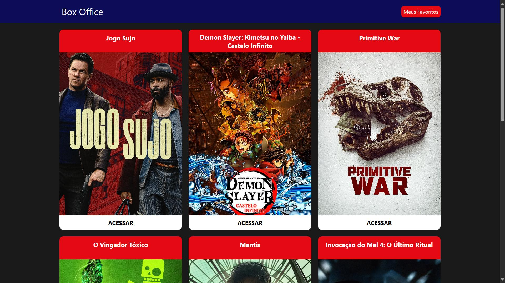
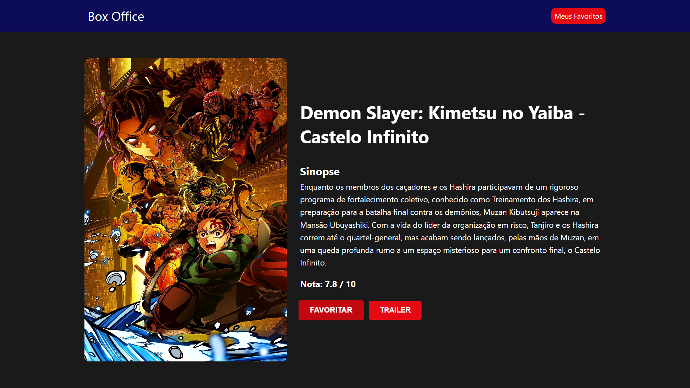
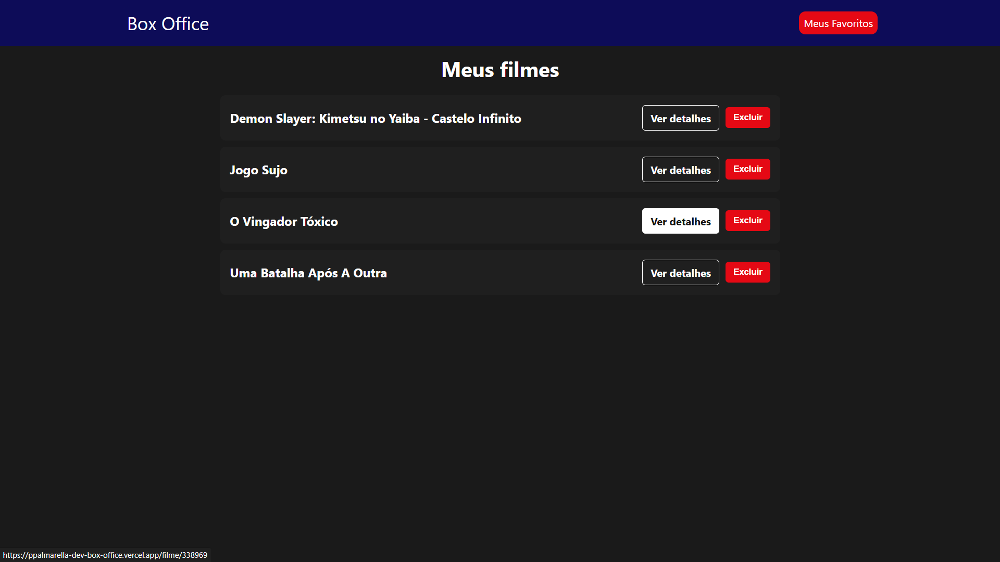

# 🍿 Box Office App

Um aplicativo web responsivo para explorar filmes em cartaz, ver detalhes e salvar seus favoritos em uma lista pessoal. O projeto foi desenvolvido como parte de um estudo prático de React e consumo de APIs.

**🚀 Link para testar:** **[https://ppalmarella-dev-box-office.vercel.app/](https://ppalmarella-dev-box-office.vercel.app/)**

---

## ✨ Funcionalidades

- **Lista de Filmes:** Navegue por uma lista de filmes que estão atualmente em cartaz.
- **Carregamento Sob Demanda:** Use o botão "Mostrar outros" para carregar mais filmes sem recarregar a página.
- **Detalhes do Filme:** Clique em um filme para ver informações detalhadas, como sinopse, nota de avaliação e pôster.
- **Trailer:** Acesso rápido a uma busca no YouTube pelo trailer do filme.
- **Sistema de Favoritos:** Salve e remova filmes da sua lista de favoritos, que fica armazenada localmente no seu navegador.
- **Responsividade:** Interface adaptada para uma ótima experiência tanto em desktops quanto em dispositivos móveis.
- **Notificações:** Feedback visual para o usuário ao favoritar um filme, utilizando `react-toastify`.

---

## 🛠️ Tecnologias Utilizadas

Este projeto foi construído com as seguintes tecnologias e ferramentas:

- **Frontend:**
  - [React](https://reactjs.org/)
  - [React Router](https://reactrouter.com/) para o sistema de rotas.
- **Comunicação com API:**
  - [Axios](https://axios-http.com/) para realizar as chamadas à API.
- **API Externa:**
  - [The Movie Database (TMDb) API](https://www.themoviedb.org/documentation/api) como fonte de dados dos filmes.
- **Estilização:**
  - CSS puro.
- **Notificações:**
  - [React Toastify](https://fkhadra.github.io/react-toastify/introduction/)
- **Deploy:**
  - [Vercel](https://vercel.com/)
 
---

## 🛠️ Configure as Variáveis de Ambiente:

### Você precisará de uma chave de API do The Movie Database (TMDb). Você pode conseguir uma de graça registrando-se no site deles.
### Na raiz do projeto, crie um arquivo chamado .env.local.
### Dentro dele, adicione sua chave de API da seguinte forma: REACT_APP_TMDB_API_KEY=SUA_CHAVE_DA_API_AQUI
